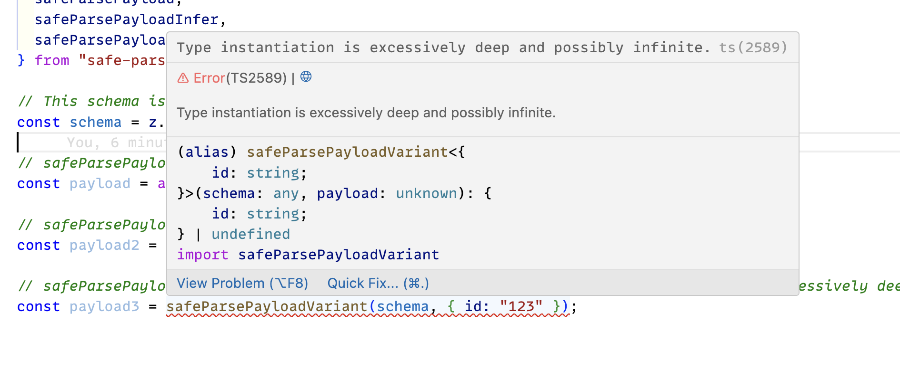

## Reproduction of https://github.com/colinhacks/zod/issues/2697

This repo reproduces [Zod 3.22.2 TS 5.2.2: TS2589: Type instantiation is excessively deep and possibly infinite](https://github.com/colinhacks/zod/issues/2697) Zod issue.

### To reproduce:

`safe-parse-payload` is a package that uses zod@3.21.4 and exports various functions to parse a payload. One of those functions is:

```ts
export function safeParsePayloadVariant<T>(
  schema: z.Schema<T>,
  payload: unknown
): T | undefined {
  const result = schema.safeParse(payload);

  if (result.success) {
    return result.data;
  }

  return undefined;
}
```

In the `reproduction` directory we have another typescript project that has `safe-parse-payload` as a dependency and `zod@3.22.2`. When a `zod@3.22.2` schema is passed to the function above, we get the "Type instantiation is excessively deep and possibly infinite" error.


